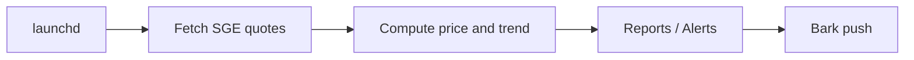

# SGE Gold Monitor

Local macOS monitor for Shanghai Gold Exchange `Au99.99`, with Bark push notifications.

## Purpose

Lightweight local macOS monitor for SGE `Au99.99`, with Bark push notifications.

## Features

- polls the official SGE minute quote endpoint every 15 minutes
- watches `Au99.99`
- sends a morning report after market open
- sends an evening report after market close
- alerts on configurable drop and target-price thresholds
- appends a short trend summary

## Configurable Values

All important thresholds are local config values instead of hardcoded constants:

- `bark_url`
- `price_threshold`
- `drop_threshold`
- `approach_ratio`

Example:

```json
{
  "bark_url": "https://api.day.app/YOUR_BARK_KEY/",
  "price_threshold": 1080,
  "drop_threshold": 0.05,
  "approach_ratio": 0.02
}
```

Use `gold_monitor.config.example.json` as the template, then create a local `gold_monitor.config.json`.

## Files

- `gold_monitor.py`
- `com.gold-monitor.plist`
- `gold_monitor.config.example.json`
- `README.md` for the primary Chinese documentation

## Operation Flow


