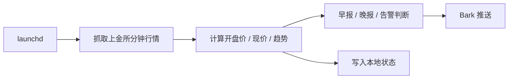

# 上金所金价监控

这是一个本地运行的 macOS 金价监控脚本，用来监控上海黄金交易所 `Au99.99`，并通过 Bark 推送到手机。

## 功能

- 每 15 分钟轮询一次上金所官方分钟行情接口
- 监控标的：`Au99.99`
- 监控日盘：北京时间交易日 `09:30-15:00`
- `09:30` 后发送早报
- `15:00` 后发送晚报
- 满足条件时发送告警
- 告警消息附带简短趋势摘要

## 可配置项

这些值不再硬编码，放在本地配置里：

- `bark_url`: Bark 推送地址
- `price_threshold`: 目标价，默认 `1080`
- `drop_threshold`: 跌幅阈值，默认 `0.05`
- `approach_ratio`: 接近目标价判定范围，默认 `0.02`

示例配置文件：

```json
{
  "bark_url": "https://api.day.app/YOUR_BARK_KEY/",
  "price_threshold": 1080,
  "drop_threshold": 0.05,
  "approach_ratio": 0.02
}
```

真实配置文件名是 `gold_monitor.config.json`，已被 Git 忽略。

## 运行流程



## 主要文件

- `gold_monitor.py`: 监控与推送逻辑
- `com.gold-monitor.plist`: macOS `LaunchAgent`
- `gold_monitor.config.example.json`: 本地配置模板
- `README.en.md`: 英文说明

## 消息示例

早报：

```text
Au99.99 早报
开市价 1128.00 元/克，现价 1128.00。
趋势:暂稳 15m+0.0 60m+0.0 距目标+48.0。 源:上金所
```

告警：

```text
Au99.99 告警
现价 1078.00 元/克，今开 1135.00。
触发:跌幅 5.02%；跌破 1080。
趋势:下行接近目标 15m-4.0 60m-18.0 距目标-2.0。 源:上金所
```

## 快速开始

进入仓库目录后，直接执行下面这组命令：

```bash
REPO_DIR="$(pwd)"
cp "$REPO_DIR/gold_monitor.config.example.json" "$REPO_DIR/gold_monitor.config.json"
open -e "$REPO_DIR/gold_monitor.config.json"
```

把 `gold_monitor.config.json` 里的 `bark_url` 改成你自己的 Bark 地址。保存后继续执行：

```bash
REPO_DIR="$(pwd)"
PYTHONDONTWRITEBYTECODE=1 python3 "$REPO_DIR/gold_monitor.py" --dry-run
PYTHONDONTWRITEBYTECODE=1 python3 "$REPO_DIR/gold_monitor.py" --test-push
```

确认没问题后，安装后台任务：

```bash
REPO_DIR="$(pwd)"
INSTALL_DIR="$HOME/Library/Application Support/gold-monitor"
mkdir -p "$INSTALL_DIR" "$HOME/Library/Logs/gold-monitor"
cp "$REPO_DIR/gold_monitor.py" "$INSTALL_DIR/gold_monitor.py"
cp "$REPO_DIR/com.gold-monitor.plist" "$INSTALL_DIR/com.gold-monitor.plist"
cp "$REPO_DIR/gold_monitor.config.json" "$INSTALL_DIR/gold_monitor.config.json"
launchctl bootout "gui/$(id -u)/com.gold-monitor" 2>/dev/null || true
launchctl bootstrap "gui/$(id -u)" "$REPO_DIR/com.gold-monitor.plist"
launchctl kickstart -k "gui/$(id -u)/com.gold-monitor"
```

## 本地检查

```bash
REPO_DIR="$(pwd)"
PYTHONDONTWRITEBYTECODE=1 python3 "$REPO_DIR/gold_monitor.py" --dry-run
```

```bash
REPO_DIR="$(pwd)"
PYTHONDONTWRITEBYTECODE=1 BARK_URL="https://api.day.app/YOUR_BARK_KEY/" python3 "$REPO_DIR/gold_monitor.py" --test-push
```

## 重新安装或升级

```bash
REPO_DIR="$(pwd)"
INSTALL_DIR="$HOME/Library/Application Support/gold-monitor"
mkdir -p "$INSTALL_DIR" "$HOME/Library/Logs/gold-monitor"
cp "$REPO_DIR/gold_monitor.py" "$INSTALL_DIR/gold_monitor.py"
cp "$REPO_DIR/com.gold-monitor.plist" "$INSTALL_DIR/com.gold-monitor.plist"
launchctl bootout "gui/$(id -u)/com.gold-monitor" 2>/dev/null || true
launchctl bootstrap "gui/$(id -u)" "$REPO_DIR/com.gold-monitor.plist"
launchctl kickstart -k "gui/$(id -u)/com.gold-monitor"
```

首次安装时再补这一步：

```text
$HOME/Library/Application Support/gold-monitor/gold_monitor.config.json
```

## 日常维护

查看任务状态：

```bash
launchctl print "gui/$(id -u)/com.gold-monitor"
```

查看日志：

- `$HOME/Library/Logs/gold-monitor/gold_monitor.log`
- `$HOME/Library/Logs/gold-monitor/gold_monitor.err.log`

查看最近一次状态：

- `$HOME/Library/Application Support/gold-monitor/.state/gold_monitor_state.json`

## 换电脑怎么迁移

1. 克隆仓库
2. 新建本地 `gold_monitor.config.json`
3. 填上那台设备自己的 Bark 地址和阈值
4. 安装 `LaunchAgent`
5. 跑一次测试推送

## 数据源说明

运行时直接调用上金所官方接口，而不是在运行时依赖 AKShare。

原因：

- AKShare 适合查文档和做交叉验证
- 生产运行时直连官方接口更轻、更稳
- 少一层依赖，维护更简单
